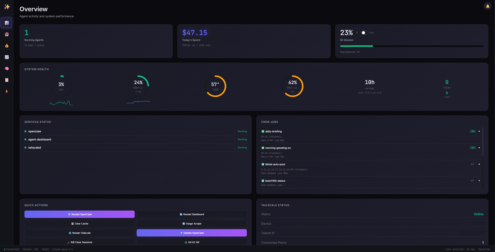

# OpenClaw Agent Dashboard

[](https://opensource.org/licenses/MIT)
[](https://nodejs.org/)
[](https://openclaw.dev)

A beautiful, secure, real-time monitoring dashboard for OpenClaw agents. Track sessions, monitor API usage, view costs, manage memory files, and keep tabs on system health — all in one place.



## 📸 Screenshots

| Overview | Sessions | Costs |
|----------|----------|-------|
|  |  |  |

| Rate Limits | Live Feed | Logs |
|-------------|-----------|------|
|  |  |  |

## ✨ Features

- 🤖 **Session Management** - View all agent sessions with real-time activity status
- 📊 **Rate Limit Monitoring** - Track Claude API usage against 5-hour rolling windows
- 💰 **Cost Analysis** - Detailed spending breakdowns by model, session, and time period
- ⚡ **Live Feed** - Real-time stream of agent messages across all sessions
- 🧠 **Memory Viewer** - Browse and read agent memory files (MEMORY.md, HEARTBEAT.md, daily notes)
- 📁 **Files Manager** - View and edit workspace files, skills, and configs with security hardening
- 📈 **System Health** - CPU, RAM, disk, temperature monitoring with sparklines
- 🔄 **Service Control** - Quick actions to restart OpenClaw, dashboard, or other services
- 📋 **Log Viewer** - Real-time system logs with auto-refresh
- ⏰ **Cron Management** - View, enable/disable, and manually trigger cron jobs
- 🌐 **Tailscale Integration** - View Tailscale status, IP, and connected peers
- 🎯 **Activity Heatmap** - Visualize peak usage hours over the last 30 days
- 🔥 **Streak Tracking** - Monitor daily activity streaks
- 🔍 **Session Search & Filtering** - Filter by status, model, date range with live search
- 🎨 **Dark Theme** - Beautiful glassmorphic UI with smooth animations
- ⌨️ **Keyboard Shortcuts** - Navigate quickly with hotkeys (1-7, Space, /, Esc, ?)
- 📱 **Mobile Responsive** - Works on phones and tablets
- 🔔 **Browser Notifications** - Get alerted when usage limits are approaching
- 📊 **Timeline View** - Visual timeline of session activity
- 💾 **Git Activity** - Track recent commits across your repos
- 🎛️ **Claude Usage Scraper** - Fetch real usage data from Claude Code CLI
- 🔄 **Auto-Refresh** - Live data updates every 5 seconds
- 🌟 **Lifetime Stats** - Total tokens, messages, cost since first session
- 📈 **Health History** - 24-hour CPU & RAM sparklines
- 🎯 **Quick Actions** - One-click system maintenance (updates, cleanup, restarts)
- 🍎 **macOS Compatible** - Full support for macOS system stats, services, and memory reporting
- 🔐 **Username/Password Auth** - Secure registration with PBKDF2 password hashing
- 🔑 **TOTP MFA** - Optional two-factor authentication (Google Authenticator compatible)
- 💾 **Remember Me** - Session-only or 3-hour persistent login
- 🛡️ **Security Hardened** - HSTS, CSP, rate limiting, timing-safe comparisons, audit logging
- 📦 **No External Dependencies** - Pure Node.js, no database required

## 🚀 Quick Start

```bash
# Clone the repository
git clone https://github.com/tugcantopaloglu/openclaw-dashboard.git
cd openclaw-dashboard

# Set your OpenClaw workspace path (optional, auto-detects if not set)
export WORKSPACE_DIR=/path/to/your/openclaw/workspace

# Start the dashboard
node server.js
```

Visit `http://localhost:7000` in your browser. On first visit, you'll see a **registration screen** where you create your username and password. After registration, log in with your credentials.

## 📦 Installation

### Prerequisites

- **Node.js** v18 or higher (check with `node --version`)
- **OpenClaw** installed and running
- **Systemd** (optional, for service installation on Linux)

### Manual Install

1. **Clone the repository**
   ```bash
   git clone https://github.com/tugcantopaloglu/openclaw-dashboard.git
   cd openclaw-dashboard
   ```

2. **Configure environment** (optional)
   ```bash
   export DASHBOARD_PORT=7000
   export WORKSPACE_DIR=/path/to/your/workspace
   export OPENCLAW_DIR=$HOME/.openclaw
   export OPENCLAW_AGENT=main
   ```

3. **Start the server**
   ```bash
   node server.js
   ```

   The server will print:
   ```
   🚀 Dashboard running on http://localhost:7000
   🔑 Recovery token: abc123def456...
   ```

   **Save the recovery token** — you'll need it if you forget your password.

4. **Access the dashboard**
   Open `http://localhost:7000` and register your account.

### Systemd Service (install.sh)

To run the dashboard as a system service with auto-start and crash recovery:

```bash
sudo ./install.sh
```

This will:
- Create `/etc/systemd/system/agent-dashboard.service`
- Create override config at `/etc/systemd/system/agent-dashboard.service.d/override.conf`
- Enable and start the service
- Set your workspace path and generate a recovery token

View logs:
```bash
journalctl -u agent-dashboard -f
```

### Environment Variables

| Variable | Description | Default |
|----------|-------------|---------|
| `DASHBOARD_PORT` | Server port | `7000` |
| `DASHBOARD_TOKEN` | Recovery token for password reset | Auto-generated on startup |
| `WORKSPACE_DIR` | OpenClaw workspace path | `$OPENCLAW_WORKSPACE` or current directory |
| `OPENCLAW_DIR` | OpenClaw config directory | `~/.openclaw` |
| `OPENCLAW_AGENT` | Agent ID to monitor | `main` |
| `DASHBOARD_ALLOW_HTTP` | Allow HTTP from non-local IPs | `false` |

**Examples:**

```bash
# Custom port
DASHBOARD_PORT=8080 node server.js

# Custom recovery token
DASHBOARD_TOKEN=my_secret_token_12345 node server.js

# Different workspace
WORKSPACE_DIR=/mnt/data/openclaw node server.js
```

## 🔐 Authentication

The dashboard uses **username and password authentication** with secure server-side sessions.

### First-Time Registration

1. Visit the dashboard URL (e.g., `http://localhost:7000`)
2. You'll see a registration screen
3. Choose a username and password
4. Click **Register**
5. Log in with your new credentials

### Login

- Enter your **username** and **password**
- Optionally check **"Remember me"** to stay logged in for 3 hours (uses `localStorage`)
- Without "Remember me", your session lasts only until you close the browser (uses `sessionStorage`)

### Password Security

- **PBKDF2 hashing** — 100,000 iterations with SHA-512
- **Random salt** — Unique per password
- **Server-side sessions** — Passwords never stored in browser, only session tokens
- **Timing-safe comparisons** — Prevents timing attacks on password verification

### Rate Limiting

To prevent brute-force attacks:
- **5 failed login attempts** → 15-minute soft lockout
- **20 failed login attempts** → Hard lockout (requires service restart)
- Rate limits are in-memory and reset when the service restarts

## 🔑 Multi-Factor Authentication (MFA)

Add an extra layer of security with time-based one-time passwords (TOTP).

### Enabling MFA

1. **Log in** to the dashboard
2. Go to the **Security** page (sidebar)
3. Click **"Enable MFA"**
4. A **QR code** appears — scan it with your authenticator app:
   - Google Authenticator (iOS, Android)
   - Authy (iOS, Android, Desktop)
   - Microsoft Authenticator (iOS, Android)
   - 1Password, Bitwarden, or any TOTP-compatible app
5. Enter the **6-digit code** shown in your app to verify
6. MFA is now active! 🎉

### Using MFA

Once enabled, every login requires:
1. Your **username** and **password** (as usual)
2. A **6-digit TOTP code** from your authenticator app

- Codes refresh every **30 seconds**
- The dashboard accepts codes with **±1 window tolerance** for clock drift (30 seconds before/after)

### Disabling MFA

1. Go to the **Security** page
2. Click **"Disable MFA"**
3. Enter your current **6-digit TOTP code** to confirm
4. MFA is now disabled

### Resetting MFA (if locked out)

If you lose access to your authenticator app (lost phone, uninstalled app, etc.):

1. **SSH into your server**
2. **Run this command** to clear the MFA secret:
   ```bash
   node -e "const fs=require('fs');const c=JSON.parse(fs.readFileSync('/root/clawd/data/credentials.json','utf8'));delete c.mfaSecret;fs.writeFileSync('/root/clawd/data/credentials.json',JSON.stringify(c,null,2));console.log('MFA cleared')"
   ```
3. **Restart the dashboard**:
   ```bash
   systemctl restart agent-dashboard
   ```
4. Log in with just your **username** and **password**
5. Re-enable MFA with a new QR code

**Important:** Adjust the path `/root/clawd/data/credentials.json` if your workspace is elsewhere.

## 🔓 Password Recovery

### Forgot Password?

If you forget your password:

1. Click **"Forgot password?"** on the login screen
2. Enter your **recovery token** (see "Finding Your Recovery Token" below)
3. Set a **new password**
4. Log in with your new password

### Finding Your Recovery Token

The recovery token (`DASHBOARD_TOKEN`) is printed when the server starts. You can find it in several places:

#### Check Server Startup Logs
```bash
journalctl -u agent-dashboard | grep "Recovery token"
```

Output:
```
🔑 Recovery token: 3e6b91f352418b486a9aa9d82fbbc1b1
```

#### Check Systemd Override Config
```bash
cat /etc/systemd/system/agent-dashboard.service.d/override.conf
```

Look for:
```ini
Environment=DASHBOARD_TOKEN=3e6b91f352418b486a9aa9d82fbbc1b1
```

#### Check Environment Variable
If you set it manually:
```bash
echo $DASHBOARD_TOKEN
```

### Changing Your Password

To change your password while logged in:

1. Go to the **Security** page
2. Enter your **current password**
3. Enter your **new password**
4. Click **"Change Password"**
5. All other sessions are invalidated (you'll need to log in again elsewhere)

### Complete Account Reset (Nuclear Option)

If everything is locked and you can't log in:

1. **SSH into your server**
2. **Delete the credentials file**:
   ```bash
   rm /root/clawd/data/credentials.json
   ```
3. **Restart the dashboard**:
   ```bash
   systemctl restart agent-dashboard
   ```
4. **Visit the dashboard** — the registration screen appears
5. **Create a new account** from scratch

**Warning:** This deletes your username, password, and MFA settings. Memory files and audit logs are not affected.

## 🛡️ Security Features

The dashboard is built with security best practices:

- **PBKDF2 password hashing** — 100,000 iterations, SHA-512, random salt
- **Timing-safe comparisons** — Prevents timing attacks on token/password verification
- **Server-side sessions** — Session tokens stored in memory, passwords never sent to browser
- **Rate limiting** — Unified rate limiter for login attempts (5 soft / 20 hard lockout)
- **HTTPS enforcement** — HTTP blocked except from localhost and Tailscale (100.64.0.0/10)
- **Security headers**:
  - **HSTS** — Force HTTPS on future visits
  - **CSP** — Content Security Policy (no inline scripts, same-origin)
  - **X-Frame-Options: DENY** — Prevent clickjacking
  - **X-Content-Type-Options: nosniff** — Prevent MIME sniffing
  - **X-XSS-Protection: 1; mode=block** — Legacy XSS protection
- **Audit logging** — All auth events and destructive actions logged to `data/audit.log`
- **CORS** — Same-origin only, no wildcard (`*`) allowed
- **Input validation**:
  - Service whitelist for logs and actions
  - Path traversal protection for file access
  - Payload size limits (1MB max)
- **Automatic backups** — `.bak` files created before overwriting workspace files

## 🌐 Network Security

The dashboard is designed for **local or Tailscale access**:

### Recommended Access Methods

1. **Localhost** — Access from the same machine: `http://localhost:7000`
2. **Tailscale** — Access from your Tailscale network: `http://100.x.x.x:7000`
   - Tailscale provides **automatic TLS encryption** (MagicDNS + HTTPS)
   - Tailscale IPs (100.64.0.0 to 100.127.255.255) are exempt from HTTPS enforcement
3. **Local network** — Access from LAN (use HTTPS or set `DASHBOARD_ALLOW_HTTP=true`)

### HTTPS Enforcement

By default, the dashboard **blocks HTTP access** from non-local IPs. Exemptions:
- **Localhost** (127.0.0.1, ::1)
- **Tailscale IPs** (100.64.0.0/10)

For other networks, the dashboard requires HTTPS or the `X-Forwarded-Proto: https` header (from a reverse proxy).

To allow HTTP from all IPs (not recommended):
```bash
DASHBOARD_ALLOW_HTTP=true node server.js
```

### Don't Expose to Public Internet

**This dashboard is NOT hardened for public internet exposure.** While it has authentication and rate limiting, it's designed for private networks. If you must expose it:
- Use a reverse proxy (nginx, Caddy) with HTTPS
- Add IP allowlisting
- Consider VPN (Tailscale, WireGuard) instead

## 🛠️ Troubleshooting

### "Too many failed attempts"

**Problem:** You see "Too many failed login attempts. Please try again later."

**Solutions:**
- Wait **15 minutes** for the soft lockout to expire
- Restart the service to clear rate limits:
  ```bash
  systemctl restart agent-dashboard
  ```
- Rate limits are in-memory and reset on restart

### Can't log in after password change

**Problem:** Your password was changed but you can't log in.

**Solution:** Use the **"Forgot password?"** flow with your recovery token to set a new password.

### MFA code not working

**Problem:** The 6-digit TOTP code is rejected.

**Solutions:**
- Ensure your **phone's clock is synchronized**:
  - iOS: Settings → General → Date & Time → Set Automatically
  - Android: Settings → System → Date & Time → Automatic date & time
- TOTP codes have **±30 second tolerance** for clock drift
- Try entering the **next code** (wait 30 seconds for it to refresh)
- If still failing, **reset MFA via SSH** (see "Resetting MFA" section)

### Dashboard not loading

**Problem:** Browser shows a blank page or connection error.

**Solutions:**
1. **Check service status**:
   ```bash
   systemctl status agent-dashboard
   ```
2. **Check logs**:
   ```bash
   journalctl -u agent-dashboard -n 50
   ```
3. **Verify port**:
   ```bash
   curl http://localhost:7000/api/auth/status
   ```
   Should return:
   ```json
   {"authenticated": false, "requiresRegistration": false}
   ```

### "HTTPS required" error

**Problem:** Browser shows "HTTPS required. Access via localhost, Tailscale, or enable HTTPS."

**Solutions:**
- Access via **localhost**: `http://localhost:7000`
- Access via **Tailscale**: `http://100.x.x.x:7000`
- Set `DASHBOARD_ALLOW_HTTP=true` in environment (not recommended):
  ```bash
  # Add to /etc/systemd/system/agent-dashboard.service.d/override.conf
  Environment=DASHBOARD_ALLOW_HTTP=true
  
  # Reload and restart
  systemctl daemon-reload
  systemctl restart agent-dashboard
  ```

### Blank page after update

**Problem:** Dashboard shows a blank page after pulling new code.

**Solutions:**
- **Hard refresh**: `Ctrl+Shift+R` (Windows/Linux) or `Cmd+Shift+R` (macOS)
- **Clear browser cache** for the dashboard URL
- **Check browser console** (F12 → Console tab) for JavaScript errors

## 📡 API Reference

The dashboard exposes a REST API for programmatic access. All endpoints require authentication via `Authorization: Bearer <sessionToken>` header.

### Unauthenticated Endpoints

- `GET /api/auth/status` — Check authentication status
- `POST /api/auth/login` — Log in with username/password (+ TOTP if MFA enabled)
- `POST /api/auth/register` — Register a new account (only if no credentials exist)
- `POST /api/auth/reset-password` — Reset password with recovery token

### Authenticated Endpoints

All other endpoints require authentication:

- `GET /api/config` — Dashboard configuration
- `GET /api/sessions` — List all agent sessions
- `GET /api/usage` — 5-hour rolling window usage data
- `GET /api/costs` — Spending data by day, model, and session
- `GET /api/system` — System health metrics
- `GET /api/memory-files` — List memory files
- `GET /api/memory-file?path=<path>` — Read a memory file
- `GET /api/key-files` — List workspace files (skills, configs)
- `GET /api/key-file?path=<name>` — Read a workspace file
- `POST /api/key-file` — Write to a workspace file (with backup)
- `GET /api/crons` — List cron jobs
- `POST /api/cron/<id>/toggle` — Enable/disable a cron job
- `POST /api/cron/<id>/run` — Manually trigger a cron job
- `GET /api/logs?service=<service>&lines=<N>` — Fetch system logs
- `POST /api/action/<action>` — Run quick actions (restart-openclaw, restart-dashboard, etc.)
- `POST /api/claude-usage-scrape` — Trigger usage scrape
- `GET /api/claude-usage` — Get last scraped usage
- `GET /api/live` — Server-Sent Events stream of real-time messages

For detailed request/response examples, see the previous version of this README or explore the API in the browser's Network tab.

## 📂 Data Files

The dashboard stores data in your workspace directory:

| File | Purpose |
|------|---------|
| `data/credentials.json` | Username + hashed password + MFA secret |
| `data/audit.log` | Security audit trail (auto-rotates at 10MB) |
| `data/health-history.json` | CPU/RAM history for sparklines |
| `data/claude-usage.json` | Last scraped Claude usage data |

**Credentials file structure:**
```json
{
  "username": "admin",
  "passwordHash": "pbkdf2_sha512$100000$...",
  "salt": "...",
  "mfaSecret": "BASE32SECRET..." // Only if MFA enabled
}
```

## 🔗 OpenClaw Integration

The dashboard automatically detects:
- **Sessions** from `$OPENCLAW_DIR/agents/$AGENT_ID/sessions/`
- **Cron jobs** from `$OPENCLAW_DIR/cron/jobs.json`
- **Memory files** from `$WORKSPACE_DIR/MEMORY.md`, `HEARTBEAT.md`, and `memory/*.md`
- **Git repos** from `$WORKSPACE_DIR/projects/*/`
- **Health data** saved to `$WORKSPACE_DIR/data/health-history.json`

### Required Files

The dashboard works best when these files exist:
- `$WORKSPACE_DIR/MEMORY.md` - Agent long-term memory
- `$WORKSPACE_DIR/HEARTBEAT.md` - Heartbeat task list
- `$WORKSPACE_DIR/memory/YYYY-MM-DD.md` - Daily memory notes
- `$WORKSPACE_DIR/scripts/scrape-claude-usage.sh` - Claude usage scraper
- `$WORKSPACE_DIR/scripts/parse-claude-usage.py` - Usage parser

## ⌨️ Keyboard Shortcuts

| Key | Action |
|-----|--------|
| `1` | Switch to Overview |
| `2` | Switch to Sessions |
| `3` | Switch to Costs |
| `4` | Switch to Rate Limits |
| `5` | Switch to Memory |
| `6` | Switch to Files |
| `7` | Switch to Live Feed |
| `Space` | Pause/Resume Feed (when on Live Feed page) |
| `/` | Focus search box |
| `Esc` | Close modals and overlays |
| `?` | Show keyboard shortcuts help |

## 🤝 Contributing

Contributions are welcome! Please follow these guidelines:

1. **Fork** the repository
2. **Create** a feature branch (`git checkout -b feature/amazing-feature`)
3. **Commit** your changes (`git commit -m 'Add amazing feature'`)
4. **Push** to the branch (`git push origin feature/amazing-feature`)
5. **Open** a Pull Request

### Development Setup

```bash
git clone https://github.com/tugcantopaloglu/openclaw-dashboard.git
cd openclaw-dashboard
export WORKSPACE_DIR=/path/to/test/workspace
node server.js
```

The dashboard has no build step — edit `server.js` or `index.html` and reload.

### Code Style

- **No comments** in code (self-documenting)
- **Brief and direct** function names

## 📄 License

MIT License - see [LICENSE](LICENSE) file for details.

## 🙏 Acknowledgments

- Built with [Claude Code](https://claude.ai)
- Built for [OpenClaw](https://openclaw.dev)
- Inspired by modern dashboards (Grafana, Vercel, Railway)
- Font: [Inter](https://rsms.me/inter/) & [JetBrains Mono](https://www.jetbrains.com/lp/mono/)

## 📞 Support

- **Issues:** [GitHub Issues](https://github.com/tugcantopaloglu/openclaw-dashboard/issues)
- **Twitter:** [@tugcantopaloglu](https://twitter.com/tugcantopaloglu)

---

Made with ✨ by [Tuğcan Topaloğlu](https://github.com/tugcantopaloglu)
